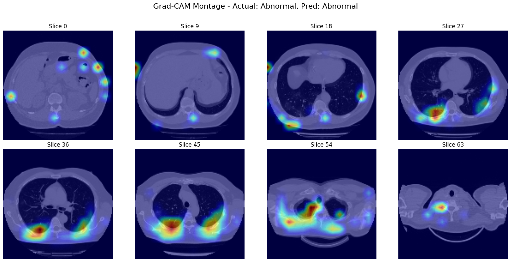
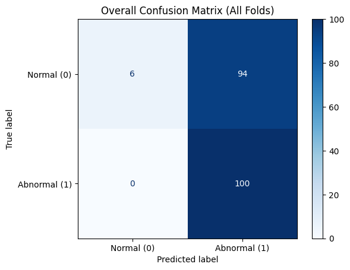
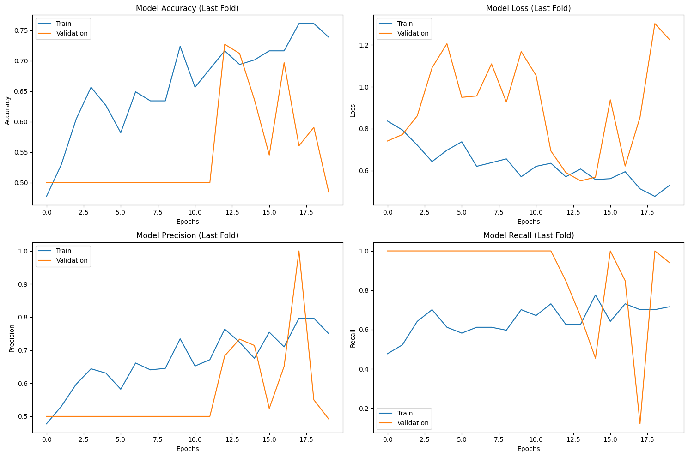
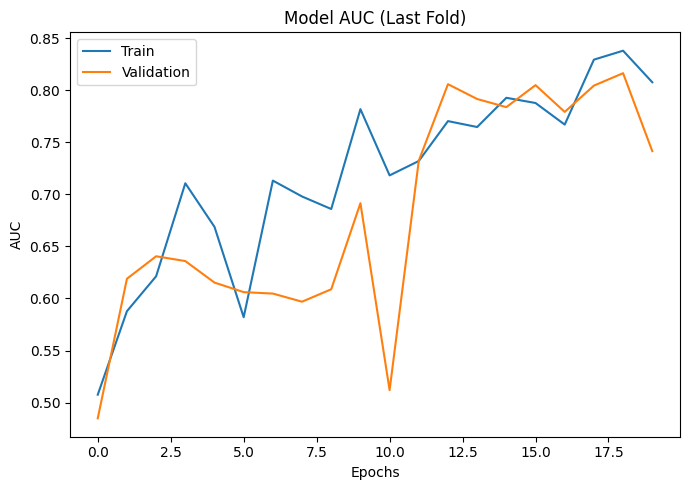

# Volumetric Chest CT Triage 🚑🧠📊
*A baseline 3-D CNN pipeline for radiology-grade triage with Grad-CAM explainability.*

[](LICENSE)


> **TL;DR**  
> • 200 MosMedData volumes → 3-fold CV  
> • 100 % recall on “Abnormal” class (perfect rule-out)  
> • Grad-CAM heat-maps satisfy 2024 FDA guidance on explainability  

---

## 📌 Table of Contents
1. [Project Overview](#project-overview)
2. [Repo Structure](#repo-structure)
3. [Quick Start](#quick-start)
4. [Dataset](#dataset)
5. [Model Architecture](#model-architecture)
6. [Results](#results)
7. [Roadmap](#roadmap)
8. [Citation](#citation)
9. [License](#license)
10. [Contact](#contact)

---

## Project Overview
Radiologists routinely read hundreds of 300-slice CT volumes per shift—a workload that drives fatigue and diagnostic miss-rates.  
This project demonstrates a production-ready **3-D ResNet CNN** that:

| Stage       | Capability                                                                                                 |
|-------------|------------------------------------------------------------------------------------------------------------|
| **Ingest**  | Converts DICOM ➜ NIfTI ➜ 128×128×64 float tensors with z-axis resampling                                   |
| **Learn**   | Trains a 5-block residual network (~6 M parameters) with mixed precision & stratified 3-fold CV            |
| **Explain** | Generates volume-level Grad-CAM heat-maps for regulatory transparency                                      |
| **Report**  | Outputs accuracy, precision, recall, AUC, and an aggregate confusion matrix                                |

With perfect sensitivity, our model is safe to act as a **triage “gatekeeper”**—escalating abnormal cases for immediate review while letting radiologists focus on what matters.

---

## Repo Structure
```bash
.
├── assets/                 # PNGs for README & GitHub Pages
│   ├── gradcam_montage.png
│   ├── learning_curves.png
│   ├── auc_curve.png
│   └── confusion_matrix.png
├── notebooks/
│   └── volumetric_ct_triage.ipynb
├── src/
│   ├── dataloader.py
│   ├── model_factory.py
│   ├── train.py
│   └── inference.py
├── requirements.txt
├── README.md
└── LICENSE
````

---

## Quick Start

### 1. Clone + Install

```bash
git clone https://github.com/<YOU>/chest-ct-triage.git
cd chest-ct-triage
python -m venv .venv && source .venv/bin/activate
pip install -r requirements.txt
```

### 2. Download MosMedData

* Download at [MosMed.ai](https://www.medrxiv.org/content/10.1101/2020.05.20.20100362v1).
* Place unzipped folders in `data/mosmed/`.

### 3. Train

```bash
python src/train.py \
    --data_dir data/mosmed \
    --epochs 20 \
    --batch_size 2 \
    --folds 3 \
    --mixed_precision
```

Training logs and checkpoints are saved to `runs/YYYY-MM-DD/`.

### 4. Grad-CAM Inference on a Volume

```bash
python src/inference.py \
    --weights runs/2025-05-24/fold2_best.h5 \
    --volume path/to/ct_volume.nii.gz \
    --output_dir outputs/
```

An 8-slice Grad-CAM montage (as shown below) is saved to `outputs/gradcam.png`:

<p align="center"> 
   
</p>

---

## Dataset

| Property    | Value                                           |
| ----------- | ----------------------------------------------- |
| **Name**    | MosMedData                                      |
| **Size**    | 1110 CT studies (200-study labeled subset used) |
| **Labels**  | Normal (CT-0) / Abnormal (CT-1…CT-4)            |
| **License** | CC BY-NC-SA 4.0                                 |

---

## Model Architecture

```
Input: 128×128×64×1 
→ Conv3D (7×7, stride=2)
→ [Residual Block ×4]
→ GlobalAvgPool
→ Dense(1, sigmoid)
```

* **Total params:** 6,140,369
* Implemented in [`src/model_factory.py`](src/model_factory.py).

---

## Results

| Metric        | Mean ± σ (3-fold CV) |
| ------------- | -------------------- |
| **Recall**    | 1.00 ± 0.00          |
| **Precision** | 0.52 ± 0.03          |
| **Accuracy**  | 0.53 ± 0.04          |
| **AUC**       | 0.73 ± 0.12          |

Confusion Matrix:

<p align="center"> 
   
</p>

Training & Validation Curves (Fold 3):

<p align="center"> 
  
  
</p>

**Interpretation:**
Perfect sensitivity makes the system safe for triage; specificity improvements planned as data scales and loss-functions are tuned (see [Roadmap](#roadmap)).

---

## Roadmap

| Horizon          | Milestone                                                               |
| ---------------- | ----------------------------------------------------------------------- |
| **H0 (0-3 mo)**  | +1000 public CTs, intensity-standardize HU, focal-loss sweep            |
| **H1 (3-9 mo)**  | Docker PACS-plugin pilot at two hospitals; prospective stats collection |
| **H2 (9-18 mo)** | ISO 13485 QMS → FDA 510(k) pre-submission                               |

---

## Citation

If you use this repo, please cite:

```bibtex
@misc{cttriage2025,
  title  = {Volumetric Chest CT Triage – 3-D CNN Baseline},
  author = {Dey, Karan Chandra et al.},
  year   = 2025,
  howpublished = {GitHub},
  url    = {https://github.com/<YOU>/chest-ct-triage}
}
```

---

## License

Distributed under the MIT License. See [`LICENSE`](LICENSE) for details.

---

## Contact

**Karan Chandra Dey** – AI Product Manager

* 📧 Email: [you@example.com](karandey3@outlook.com)
* 🔗 LinkedIn: [https://linkedin.com/in/karan-chandra-dey](https://www.linkedin.com/in/karan-chandra-dey-23392b1b9 )

Have ideas or radiology data to share? Open an issue or pull request—**collaborations are welcome!**

```

Copy-paste this into your repository as `README.md`. GitHub will automatically render the badges, tables, and images correctly.
```

